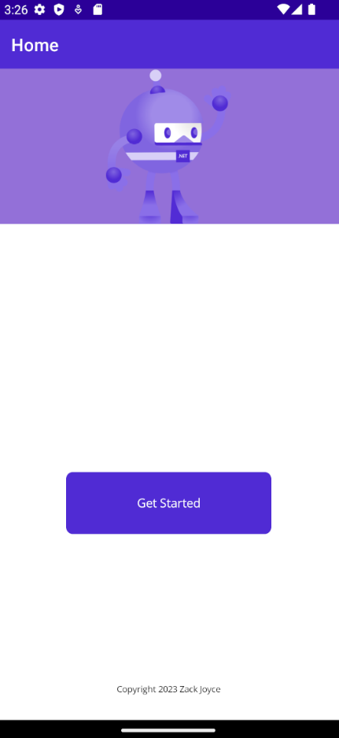
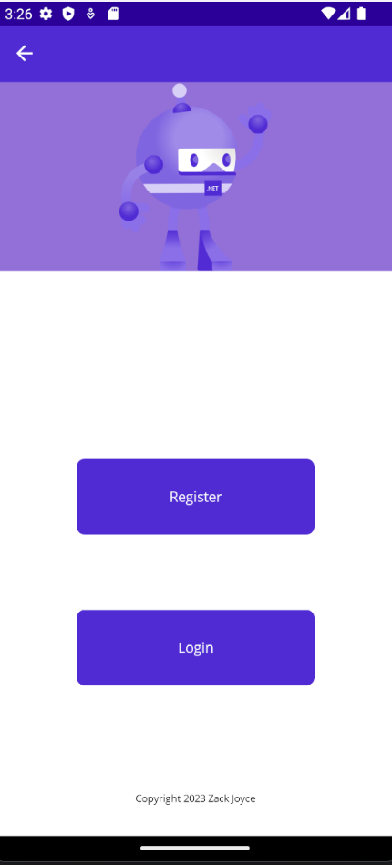
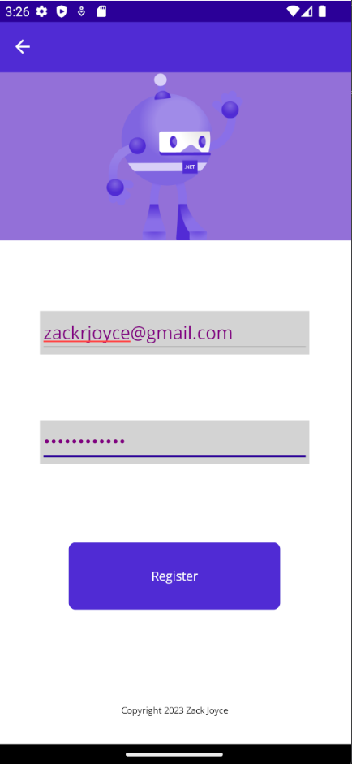
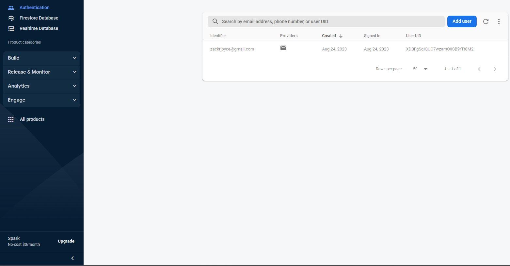
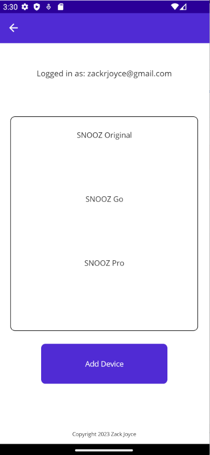
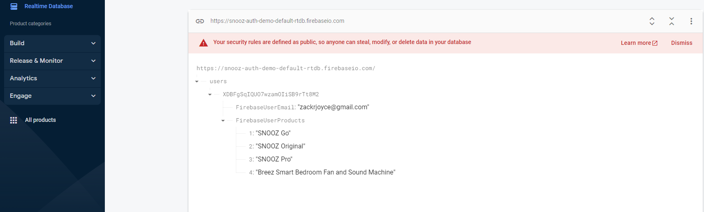

**Authentication System Firebase .NET Maui**

This README file provides an overview of the Authentication System built for .NET Maui using Firebase. This system incorporates Firebase Authentication and Firebase Realtime Database capabilities to create a robust and secure user authentication and data storage solution.

Features
Firebase Authentication: The system provides a seamless and secure authentication process for users. It includes both registration and login capabilities. Users can create accounts using their email and password, and subsequently log in using their credentials.

Error Handling: Robust error handling mechanisms are implemented to ensure a smooth user experience. Common authentication errors, such as incorrect credentials or account not found, are gracefully handled and communicated to the user.

Firebase Realtime Database: This system integrates Firebase Realtime Database, enabling real-time data storage and retrieval. User profiles are created in the database, allowing for the storage of user-specific information.

User Profiles: User profiles are automatically generated upon registration and are stored in the Firebase Realtime Database. These profiles can be customized to include information such as user names, profile pictures, and other relevant data.

Getting Started
To get started with this Authentication System in your .NET Maui project, follow these steps:

Firebase Setup: Ensure you have set up a Firebase project and obtained the necessary Firebase configuration files (e.g., google-services.json for Android and GoogleService-Info.plist for iOS).

Authentication Integration: Integrate the Firebase Authentication SDK into your .NET Maui project by following the documentation provided by Firebase. This will include initializing Firebase, setting up sign-in methods, and handling user authentication.

Realtime Database Integration: Integrate Firebase Realtime Database into your project, configure database rules, and implement data storage and retrieval logic.

User Profiles: Customize the user profile structure in the database to suit your application's needs. Ensure that user profiles are created upon registration and updated as needed.

Error Handling: Implement error handling mechanisms to handle authentication errors gracefully and provide feedback to users.

Main Page of the App

User select Authentication tab Flyout Menu.

User register screen with error handling to avoid account duplication, invalid passwords, and other relevant errors.

Authentication tab in Firebase Database showing the newly created user.

Product page with "Add Product" button, allowing users to associate certain products with their account.

Realtime Database tab, showing products associated with account.

